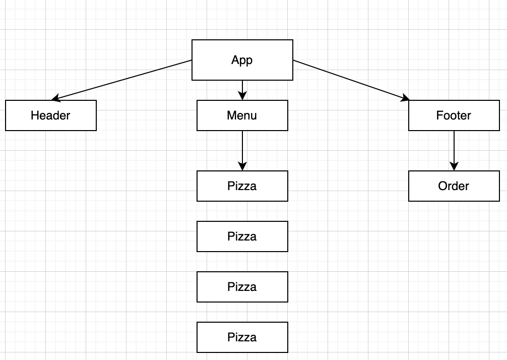

# Website Logic Documentation

## Overview

This document provides an overview of the logic and algorithms used in the website's

## Diagram

## Steps

- Create App Component which contains three main components Header, Footer, and Menu.

- inside Header Component return h1
- inside Menu Component:

  - Check if length of pizzaData > 0 map on lists else return message "We are still working on the menu"

- inside Footer Component
  - Check if hour is between open and close our then return order component which has paragraph & button order | else return a paragrph with message "We are happy to welcome you at open & close hour"
